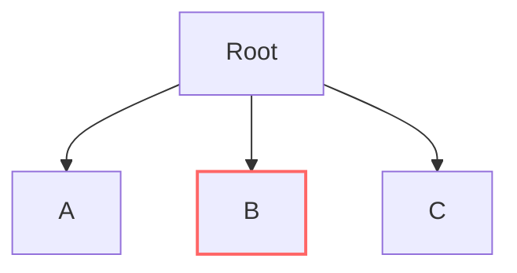

# FAQ

## Is Capataz production ready?

We are currently using [go-Capataz](https://github.com/capatazlib/go-capataz) in
various production systems at [DigitalOcean](https://digitalocean.com) with
great success.

There are implementations in various languages but these are not production
ready and currently on (very slow paced) development.

## Is Capataz an actor system like Akka?

No. Capataz doesn't enforce or prescribe the Actor model as a way to accomplish
Supervision Trees. It encourages the usage of monitored
threads/routines/processes as a way to encapsulate business logic; however, it
doesn't impose any communication mechanisms between these threads.

## I use systemd/k8s, is Capataz still useful for me?

It depends. You may want to avoid restarting your program when a single logical
component in your application is failing. For example. Let's assume that your
application contains three logical components `A`, `B`, `C`.

In this context, component `A` takes a considerate amount of time to build some
state (cache). You probably want to avoid crashing your application (resetting
that expensive state) when an error in component `B` occurs.

With Capataz you can tune the granularity of your restart strategy, adding
[bulkheads](https://www.oreilly.com/library/view/release-it-2nd/9781680504552/f_0050.xhtml)
around components `A`, `B`, and `C` via supervision trees and restarting only
the component that is failing (`B` in this example).

## Should I use supervision trees everywhere?

It may be tempting, but no, we only recommend using Capataz in applications
where multiple components run concurrently and could fail in unexpected ways.

For example, if your application runs a single server (gRPC, HTTP), there is a
good change the server library already offers a reliable error handling
strategy, and adding Capataz may be overkill.

## Is it good to restart forever?

In most situations, no. You want to ensure Supervision trees have a [restart
tolerance]() that works for your application, so that it propagates failures up
until the whole program gives up.

You want to do this for a couple of reasons:

* It triggers error notifications on your system when recovery mechanisms (like
  restarting an invalid state) are not working (fail fast).

* If logical components at the bottom of your tree are failing because some
  resource (allocated at the root of the supervisor) is in an invalid state, you
  want to make sure that restarts get propagated to the very top of the
  application.

By default, Capataz allows one (1) worker failure every five (5) seconds, if
your business domain requires the tolerance of more errors, you need to tweak
your supervision tree settings.

Remember, a supervision tree and a _properly configured_ supervision tree are
two different things.

## Is Capataz a library or a framework?

It depends. If you use Capataz to spawn workers without relying on supervisors
to manage the state of your application, we argue Capataz may be a drop-in
library that replaces to your language's thread spawning mechanism.

It is unlikely that you will have a group of workers that do not communicate
between each other in a useful application, so you would rely on Capataz to
manage your resource lifecycles. This use-case moves the needle towards Capataz
being a framework.

All of this said, we developed Capataz with the framework use-case in mind.

## Are there Capataz extensions?

Unfortunately at the current time there are no open-source libraries that
would integrate Capataz with other observability tools like logging, Prometheus
or any visualization tool.
