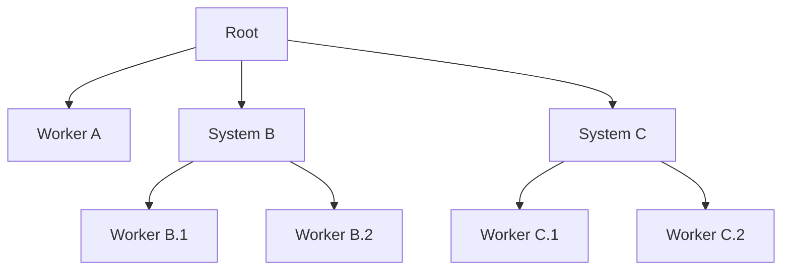

> Our greatest glory is not in never failing, but in rising every time we fail.
>
> Confucius.

### What are Supervision Trees?

A Supervision Tree is a design pattern where developers build applications as a
composable group of nodes that form a tree.

By designing applications this way, we accomplish a few desirable properties:

* Every sub-tree node is responsible of supervising it's children failures,
  restarting them when needed.

* Every sub-tree node encapsulates a specific scope of the application.

* Every leaf node encapsulates some business logic that may use resources shared
  across sibling nodes.

* When we nest one sub-tree into another, we compose multiple sub-applications
  together in a way that facilitates splitting them apart when necessary (when
  doing microservices, for example.)

### Why Restarts fix (most of) my problems?

You may find that one of the top 3 culprits of failing systems is invalid states
at program runtime. It is pretty much inevitable, a system may be able to have
infinite combinations of values in their runtime state, and some of these
combinations are not valid or expected, making our systems crash with broken
assumptions.

A way to deal with this issue is to [make invalid states
impossible](https://www.youtube.com/watch?v=IcgmSRJHu_8), but that is a costly
endeavour, more so in dynamic typed languages or [languages that fill up empty
values with "sane defaults" for the sake of
simplicity](https://play.golang.org/p/KkWpwBh-8Y_D).

When we develop software, we start from a state that is known to work, and our
system would later evolve into an invalid one, crashing again. By restarting our
components, we can guarantee that when your application encounters an error
state, it will reset itself to a healthy state as soon as possible.

Later, we can assess through error reports what went wrong and fix our code so
that it doesn't crash unnecessarily. The main idea is to [let our applications
crash fast](https://en.wikipedia.org/wiki/Fail-fast) to be back in business
again.

The folks at Ericson had great success with this approach by designing
[Erlang](https://erlang.org/doc/) to have this feature front-and-center via
Supervision Trees.

### Long Term Goal

Capataz wants to offer a supervision tree specification that can be implemented
across multiple programming languages and provide cross-language test-suites.
